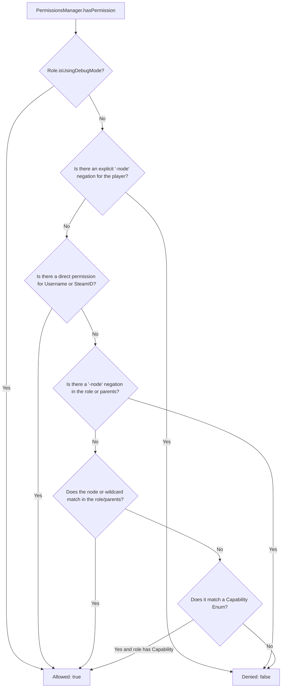

[Home](../wiki-language.md) > [Documentation](wiki-main.md) > Permissions and Roles (Permissions)

## 🛡️ Permissions and Roles (PermissionsManager)

The **Avrix** permissions and roles management subsystem extends Project Zomboid's native authorization system.
Management is performed through the central `PermissionsManager` service.

---

### Architectural Overview and Declarative `permissions.yml`

The configuration file `permissions.yml`, automatically generated at `plugins/avrix-api/permissions.yml`, serves as the
authoritative source of truth.

#### Initialization Lifecycle:

1. **Database Schema**: When the SQLite connection is established (`ServerWorldDatabase.create()`), the auxiliary tables
   `role_permissions`, `role_parents`, and `role_metadata` are created, and the `prefix` and `suffix` columns are added
   to the `role` table.
2. **Configuration Loading**: Upon completion of the `Roles.init()` method, the `RolesMixin` hook triggers, loading
   `permissions.yml`. This ensures that standard roles (`admin`, `moderator`, `user`, etc.) have already received
   persistent SQLite primary keys and are not duplicated.
3. **Secure Player Binding (Zero-Trust)**: User roles are cached in memory and safely assigned upon player
   authentication (`syncPlayerLoginRole`), preventing the creation of stub accounts without passwords in the database.

---

### `permissions.yml` File Structure

```yaml
# =========================================================================
# Avrix Permissions & Roles Configuration File
# =========================================================================

groups:
  admin:
    description: "Server Administrator with full root access"
    color: "255,50,50,255"
    prefix: "[Admin] "
    suffix: ""
    permissions:
      - "*"
    capabilities:
      - "*"
    parents: [ ]

  moderator:
    description: "Server Moderator - all capabilities except core server control"
    color: "50,255,50,255"
    prefix: "[Mod] "
    suffix: ""
    permissions:
      - "avrix.commands.kick"
      - "avrix.commands.teleport.*"
      - "-avrix.commands.teleport.secretzone" # Explicit negation
    capabilities:
      - "LoginOnServer"
      - "PriorityLogin"
      - "CanSeePlayersStats"
      - "KickUser"
      - "BanUnbanUser"
    parents:
      - "user"

  vip:
    description: "VIP Supporter role"
    color: "255,215,0,255"
    prefix: "[VIP] "
    suffix: " ★"
    permissions:
      - "avrix.chat.color"
      - "avrix.kits.vip"
    capabilities:
      - "LoginOnServer"
      - "PriorityLogin"
    parents:
      - "user"
    metadata:
      maxHomes: "5"
      chatColor: "gold"

  user:
    description: "Default Survivor"
    color: "255,255,255,255"
    prefix: ""
    suffix: ""
    permissions:
      - "avrix.commands.help"
    capabilities:
      - "LoginOnServer"
    parents: [ ]

  banned:
    description: "Banned role - forbidden from logging in"
    color: "128,128,128,255"
    prefix: "[Banned] "
    suffix: ""
    permissions: [ ]
    capabilities: [ ]
    parents: [ ]

users:
  # Role and direct permission assignment by Username
  "Brov3r":
    group: "admin"
    permissions:
      - "avrix.developer.debug"

  # Role and temporary permission assignment by 64-bit SteamID
  76561198012345678:
    group: "vip"
    temporaryPermissions:
      "avrix.boost.experience": "2026-12-31T23:59:59Z"
```

---

### Programmatic Role Creation and Modification (`ExtendedRole`)

The `ExtendedRole` class extends the native `zombie.characters.Role`, lifting vanilla `readOnly` constraints when
invoking methods that add permissions and capabilities.

```java
package com.example.plugin;

import com.avrix.api.events.DefaultEvents;
import com.avrix.api.events.SubscribeEvent;
import com.avrix.api.permissions.ExtendedRole;
import com.avrix.api.permissions.PermissionsManager;
import com.avrix.plugins.Plugin;
import com.avrix.plugins.PluginData;
import zombie.characters.Capability;
import zombie.characters.Roles;
import zombie.core.Color;

import java.util.List;

public class ExamplePlugin implements Plugin {

    @Override
    public void onInitialize(PluginData pluginData) {
        // Plugin event listener registration
    }

    @SubscribeEvent(DefaultEvents.ON_SERVER_STARTED)
    private void onServerStarted() {
        // Check if the role exists in the registry
        if (Roles.getRole("Elite") == null) {
            ExtendedRole elite = PermissionsManager.createRole(
                    "Elite",
                    "Elite status with extended privileges",
                    new Color(0.2f, 0.8f, 1.0f, 1.0f),
                    List.of(Capability.LoginOnServer, Capability.PriorityLogin),
                    "avrix.chat.color",
                    "avrix.commands.fly"
            );

            // Configure prefixes, inheritance, and metadata
            elite.setPrefix("[Elite] ");
            elite.setSuffix(" ✦");
            elite.addParent("user");
            elite.setMeta("maxHomes", "10");

            // Persist changes to SQLite and synchronize across the network
            PermissionsManager.saveRoleToDatabase(elite);
        }
    }
}
```

---

### Assigning Roles to Players and Connections

```java
// 1. To an online player entity (synchronizes entity, network, and database)
PermissionsManager.assignRole(player, "admin");

// 2. To a network connection (UdpConnection)
PermissionsManager.

assignRole(connection, "moderator");

// 3. By Username or SteamID64 (for online players and database updates)
PermissionsManager.

assignRole("Brov3r","admin");
PermissionsManager.

assignRole("76561198012345678","vip");
```

---

### Permission Evaluation (`hasPermission`)

The permission evaluation algorithm enforces strict priority for negative nodes (**Negations First**):



#### Evaluation Examples:

```java
// Check on an IsoPlayer
if(PermissionsManager.hasPermission(player, "avrix.commands.heal")){
        player.

getBodyDamage().

RestoreToFullHealth();
}

// Check on an active UdpConnection
        if(PermissionsManager.

hasPermission(connection, "avrix.admin.panel")){
        // Send UI network packet
        }

// Check on a Role object
        if(PermissionsManager.

hasPermission(role, "avrix.chat.color")){
        // Allow chat formatting
        }
```

---

### Wildcard and Negation Matching Table

| Granted Permission (`Granted`) | Checked Permission (`Checked`) | Result  | Description                                            |
|:-------------------------------|:-------------------------------|:-------:|:-------------------------------------------------------|
| `*`                            | `any.node`                     | `true`  | Global root access to all permissions                  |
| `avrix.commands.*`             | `avrix.commands.teleport`      | `true`  | Covers all first-level child nodes                     |
| `avrix.commands.*`             | `avrix.commands.zone.create`   | `true`  | Covers nested subtrees                                 |
| `avrix.commands.*`             | `avrix.chat.color`             | `false` | Different permission branch                            |
| `-avrix.commands.stop`         | `avrix.commands.stop`          | `false` | Explicit negation overrides group wildcard permissions |
| `avrix.kit.vip`                | `avrix.kit.vip`                | `true`  | Exact direct match                                     |

---

### Personal Permanent and Temporary Permissions

The service supports granting permissions for a specific duration with automatic purging upon expiration.

```java
import java.time.Instant;
import java.util.Collection;
import java.util.concurrent.TimeUnit;

// Permanent personal permission (by Username or SteamID64)
PermissionsManager.grantPermissionToPlayer("Brov3r","avrix.special.access");

// Temporary permission for 7 days
PermissionsManager.

grantPermissionToPlayer("Brov3r","avrix.vip.boost",7,TimeUnit.DAYS);

// Temporary permission until an exact ISO-8601 timestamp
PermissionsManager.

grantPermissionToPlayer("76561198012345678","avrix.event.2026",Instant.parse("2026-12-31T23:59:59Z"));

// Revoke permission
        PermissionsManager.

revokePermissionFromPlayer("Brov3r","avrix.special.access");

// Retrieve active entries with expiration validation
Collection<PlayerPermission> entries = PermissionsManager.getPlayerPermissionEntries("Brov3r");
for(
PlayerPermission entry :entries){
        System.out.

printf("Node: %s, Expired: %s, Expiration: %s%n",
       entry.node(),entry.

isExpired(),entry.

expirationDate());
        }
```

---

### Native `Capability` Checks

```java
// Check on an online player entity
boolean canFly = PermissionsManager.hasCapability(player, Capability.ToggleNoclipHimself);

// Check on an active network socket
boolean canSeeStats = PermissionsManager.hasCapability(connection, Capability.CanSeePlayersStats);

// Check by username
boolean canJoin = PermissionsManager.hasCapability("Brov3r", Capability.LoginOnServer);
```

---

### Subsystem Events (`ServerEvents`)

The subsystem publishes the following events via `EventManager`:

| Event Name                          | Arguments                                         | Description                                                   |
|:------------------------------------|:--------------------------------------------------|:--------------------------------------------------------------|
| `ServerEvents.PLAYER_ROLE_ASSIGNED` | `IsoPlayer player, Role oldRole, Role newRole`    | Triggered when a player's role changes                        |
| `ServerEvents.PERMISSION_GRANTED`   | `String identifier, String node, Instant expires` | Triggered when a permanent or temporary permission is granted |
| `ServerEvents.PERMISSION_REVOKED`   | `String identifier, String node`                  | Triggered when a permission is revoked                        |