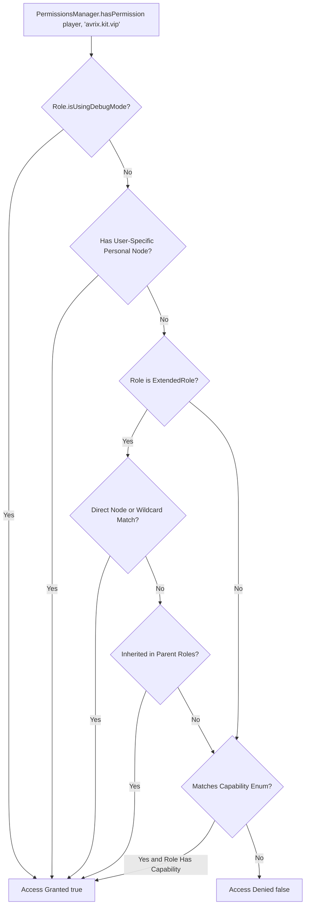

[Main](../wiki-language.md) > [Documentation](wiki-main.md) > Permissions and Roles

## 🛡️ Permissions and Roles (PermissionsManager)

The **Avrix** permissions and roles subsystem enriches Project Zomboid's native role subsystem by adding custom string
permission nodes (`permissions`), wildcard and prefix matching, hierarchical role inheritance trees, metadata (prefixes
and suffixes), and automated SQLite persistence (`ServerWorldDatabase`).

All operations are handled through the central static service `PermissionsManager`.

---

### Creating and Persisting Roles

To create a new role, use the `PermissionsManager.createRole(...)` method. The method automatically registers the role
in the native `Roles` registry, persists it into the server's SQLite database, and synchronizes the state across all
connected clients via network broadcast packets.

```java
package com.example.plugin;

import com.avrix.api.events.DefaultEvents;
import com.avrix.api.events.SubscribeEvent;
import com.avrix.api.permissions.ExtendedRole;
import com.avrix.api.permissions.PermissionsManager;
import com.avrix.plugins.Plugin;
import com.avrix.plugins.PluginData;
import zombie.characters.Capability;
import zombie.characters.Roles;
import zombie.core.Color;

import java.util.List;

public class ExamplePlugin implements Plugin {

    private static final String ROLE_VIP = "VIP";

    @Override
    public void onInitialize(PluginData pluginData) {
        // Register event listeners
    }

    @SubscribeEvent(DefaultEvents.ON_SERVER_STARTED)
    private void onServerStarted() {
        // Create role if it does not yet exist in the database
        if (Roles.getRole(ROLE_VIP) == null) {
            ExtendedRole vip = PermissionsManager.createRole(
                    ROLE_VIP,
                    "VIP player with colored chat and special perks",
                    new Color(1.0f, 0.84f, 0.0f, 1.0f), // Gold color
                    List.of(Capability.LoginOnServer, Capability.CanSeePlayersStats),
                    "avrix.chat.color",
                    "avrix.commands.fly",
                    "avrix.kits.vip"
            );

            // Configure visual prefix and inheritance
            vip.setPrefix("&6[VIP]&f ");
            vip.addParent("User");
            vip.setMeta("maxHomes", "3");

            // Persist updated attributes to SQLite
            PermissionsManager.saveRoleToDatabase(vip);
        }
    }
}
```

---

### Assigning Roles to Players and Connections

The service allows assigning roles to online players (`IsoPlayer`, `UdpConnection`) as well as offline user accounts by
their username.

#### 1. Assigning to an In-Game Player

```java
@SubscribeEvent(custom = "OnPlayerConnected")
private void onPlayerJoin(IsoPlayer player, IConnection connection) {
    if ("Brov3r".equalsIgnoreCase(player.getUsername())) {
        // Assigns role to player entity, network socket, and persists record in SQLite (whitelist)
        boolean success = PermissionsManager.assignRole(player, "VIP");
        System.out.println("Role assigned: " + success);
    }
}
```

#### 2. Assigning by Username (Online or Offline)

```java
// If online: updates active entity and connection; if offline: updates database record directly
PermissionsManager.assignRole("Alex", "Moderator");
```

#### 3. Assigning to a Network Connection (`UdpConnection`)

```java
PermissionsManager.assignRole(udpConnection, "Admin");
```

---

### Evaluating Permissions (`hasPermission`)

Permission checks support global wildcards (`*`), hierarchical branch wildcards (`avrix.commands.*`), role inheritance
trees, and user-specific personal overrides.



#### Code Examples:

```java
// 1. Evaluating an in-game IsoPlayer instance
if (PermissionsManager.hasPermission(player, "avrix.commands.heal")) {
    player.getBodyDamage().RestoreToFullHealth();
}

// 2. Evaluating an active UdpConnection socket
if (PermissionsManager.hasPermission(connection, "avrix.admin.notify")) {
    // Send administrative notification packet
}

// 3. Evaluating a Role instance
Role role = player.getRole();
if (PermissionsManager.hasPermission(role, "avrix.chat.color")) {
    // Apply chat formatting
}
```

---

### Wildcard and Prefix Rules

| Granted Node (`Granted`) | Evaluated Query (`Checked`) | Result  | Description                                   |
|:-------------------------|:----------------------------|:-------:|:----------------------------------------------|
| `*`                      | *any permission node*       | `true`  | Global root wildcard granting all permissions |
| `avrix.commands.*`       | `avrix.commands.heal`       | `true`  | Matches direct descendant nodes               |
| `avrix.commands.*`       | `avrix.commands.tp.coords`  | `true`  | Matches multi-level nested sub-branches       |
| `avrix.commands.*`       | `avrix.chat.color`          | `false` | Independent branch                            |
| `avrix.kit.vip`          | `avrix.kit.vip`             | `true`  | Exact node match                              |

---

### User-Specific Personal Permissions

To grant or revoke permissions for a specific username without altering their role:

```java
// Grant permission to a specific username
PermissionsManager.grantPermissionToPlayer("Brov3r", "avrix.special.event2026");

// Revoke a personal permission
PermissionsManager.revokePermissionFromPlayer("Brov3r", "avrix.special.event2026");

// Clear all personal permissions for a user (e.g. upon session teardown)
PermissionsManager.clearPlayerPermissions("Brov3r");

// Retrieve an unmodifiable set of granted personal permissions
Set<String> perms = PermissionsManager.getPlayerPermissions("Brov3r");
```

---

### Native Project Zomboid `Capability` Checks

For seamless compatibility with vanilla engine logic, helper methods evaluating the native `Capability` enum are
provided:

```java
// Evaluating an in-game player
boolean canCheat = PermissionsManager.hasCapability(player, Capability.ToggleGodModHimself);

// Evaluating a network connection socket
boolean canSeeStats = PermissionsManager.hasCapability(connection, Capability.CanSeePlayersStats);

// Evaluating a Role instance
boolean canLogin = PermissionsManager.hasCapability(role, Capability.LoginOnServer);

// Evaluating by username
boolean canSetupZone = PermissionsManager.hasCapability("Brov3r", Capability.CanSetupNonPVPZone);
```

---

### Deleting Roles

```java
// Deletes role from memory, Roles registry, and SQLite database while cascading permission cleanup
boolean deleted = PermissionsManager.deleteRole("OldRole", "AdminName");
```