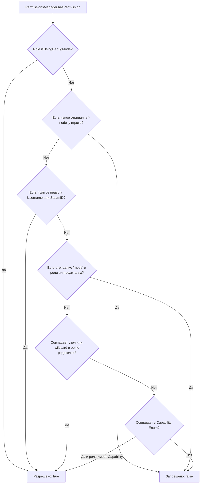

[Главная](../wiki-language.md) > [Документация](wiki-main.md) > Права и роли (Permissions)

## 🛡️ Права и роли (PermissionsManager)

Подсистема управления правами и ролями **Avrix** расширяет нативную систему авторизации Project Zomboid.
Управление осуществляется через центральный сервис `PermissionsManager`.

---

### Архитектурный обзор и декларативный `permissions.yml`

Главным источником истины (Authoritative Source) выступает конфигурационный файл `permissions.yml`, автоматически
генерируемый по пути `plugins/avrix-api/permissions.yml`.

#### Жизненный цикл инициализации:

1. **Схема базы данных**: В момент создания подключения к SQLite (`ServerWorldDatabase.create()`) создаются
   вспомогательные таблицы `role_permissions`, `role_parents`, `role_metadata` и добавляются колонки `prefix`, `suffix`
   в таблицу `role`.
2. **Загрузка конфигурации**: По завершении метода `Roles.init()` срабатывает хук `RolesMixin`, загружающий
   `permissions.yml`. Это гарантирует, что стандартные роли (`admin`, `moderator`, `user` и др.) уже получили постоянные
   первичные ключи SQLite и не дублируются.
3. **Безопасная привязка игроков (Zero-Trust)**: Роли пользователей кэшируются в памяти и безопасно назначаются в момент
   авторизации игрока (`syncPlayerLoginRole`), не создавая в базе аккаунтов-пустышек без пароля.

---

### Структура файла `permissions.yml`

```yaml
# =========================================================================
# Avrix Permissions & Roles Configuration File
# =========================================================================

groups:
  admin:
    description: "Server Administrator with full root access"
    color: "255,50,50,255"
    prefix: "[Admin] "
    suffix: ""
    permissions:
      - "*"
    capabilities:
      - "*"
    parents: [ ]

  moderator:
    description: "Server Moderator - all capabilities except core server control"
    color: "50,255,50,255"
    prefix: "[Mod] "
    suffix: ""
    permissions:
      - "avrix.commands.kick"
      - "avrix.commands.teleport.*"
      - "-avrix.commands.teleport.secretzone" # Явный запрет
    capabilities:
      - "LoginOnServer"
      - "PriorityLogin"
      - "CanSeePlayersStats"
      - "KickUser"
      - "BanUnbanUser"
    parents:
      - "user"

  vip:
    description: "VIP Supporter role"
    color: "255,215,0,255"
    prefix: "[VIP] "
    suffix: " ★"
    permissions:
      - "avrix.chat.color"
      - "avrix.kits.vip"
    capabilities:
      - "LoginOnServer"
      - "PriorityLogin"
    parents:
      - "user"
    metadata:
      maxHomes: "5"
      chatColor: "gold"

  user:
    description: "Default Survivor"
    color: "255,255,255,255"
    prefix: ""
    suffix: ""
    permissions:
      - "avrix.commands.help"
    capabilities:
      - "LoginOnServer"
    parents: [ ]

  banned:
    description: "Banned role - forbidden from logging in"
    color: "128,128,128,255"
    prefix: "[Banned] "
    suffix: ""
    permissions: [ ]
    capabilities: [ ]
    parents: [ ]

users:
  # Назначение роли и прямых прав по Username
  "Brov3r":
    group: "admin"
    permissions:
      - "avrix.developer.debug"

  # Назначение роли и временных прав по 64-битному SteamID
  76561198012345678:
    group: "vip"
    temporaryPermissions:
      "avrix.boost.experience": "2026-12-31T23:59:59Z"
```

---

### Программное создание и модификация ролей (`ExtendedRole`)

Класс `ExtendedRole` расширяет нативный `zombie.characters.Role`, снимая ванильные ограничения `readOnly` при вызове
методов добавления прав и capabilities.

```java
package com.example.plugin;

import com.avrix.api.events.DefaultEvents;
import com.avrix.api.events.SubscribeEvent;
import com.avrix.api.permissions.ExtendedRole;
import com.avrix.api.permissions.PermissionsManager;
import com.avrix.plugins.Plugin;
import com.avrix.plugins.PluginData;
import zombie.characters.Capability;
import zombie.characters.Roles;
import zombie.core.Color;

import java.util.List;

public class ExamplePlugin implements Plugin {

    @Override
    public void onInitialize(PluginData pluginData) {
        // Регистрация слушателя событий плагина
    }

    @SubscribeEvent(DefaultEvents.ON_SERVER_STARTED)
    private void onServerStarted() {
        // Проверяем наличие роли в реестре
        if (Roles.getRole("Elite") == null) {
            ExtendedRole elite = PermissionsManager.createRole(
                    "Elite",
                    "Элитный статус с расширенными правами",
                    new Color(0.2f, 0.8f, 1.0f, 1.0f),
                    List.of(Capability.LoginOnServer, Capability.PriorityLogin),
                    "avrix.chat.color",
                    "avrix.commands.fly"
            );

            // Настройка префиксов, наследования и метаданных
            elite.setPrefix("[Elite] ");
            elite.setSuffix(" ✦");
            elite.addParent("user");
            elite.setMeta("maxHomes", "10");

            // Сохранение изменений в SQLite и синхронизация по сети
            PermissionsManager.saveRoleToDatabase(elite);
        }
    }
}
```

---

### Назначение ролей игрокам и сокетам

```java
// 1. Живому объекту игрока (синхронизирует сущность, сеть и БД)
PermissionsManager.assignRole(player, "admin");

// 2. Сетевому соединению UdpConnection
PermissionsManager.

assignRole(connection, "moderator");

// 3. По имени пользователя или SteamID64 (для онлайн-игроков и обновления БД)
PermissionsManager.

assignRole("Brov3r","admin");
PermissionsManager.

assignRole("76561198012345678","vip");
```

---

### Оценка прав доступа (`hasPermission`)

Алгоритм вычисления прав гарантирует строгий приоритет отрицаний (**Negations First**):



#### Примеры проверок:

```java
// Проверка у IsoPlayer
if(PermissionsManager.hasPermission(player, "avrix.commands.heal")){
        player.

getBodyDamage().

RestoreToFullHealth();
}

// Проверка у UdpConnection
        if(PermissionsManager.

hasPermission(connection, "avrix.admin.panel")){
        // Отправка пакета интерфейса
        }

// Проверка у Role
        if(PermissionsManager.

hasPermission(role, "avrix.chat.color")){
        // Разрешить форматирование чата
        }
```

---

### Таблица сопоставления масок и отрицаний

| Выданное право (`Granted`) | Запрошенное право (`Checked`) | Результат | Описание                                          |
|:---------------------------|:------------------------------|:---------:|:--------------------------------------------------|
| `*`                        | `любой.узел`                  |  `true`   | Глобальный root-доступ ко всем правам             |
| `avrix.commands.*`         | `avrix.commands.teleport`     |  `true`   | Покрывает все дочерние узлы первого уровня        |
| `avrix.commands.*`         | `avrix.commands.zone.create`  |  `true`   | Покрывает вложенные поддеревья                    |
| `avrix.commands.*`         | `avrix.chat.color`            |  `false`  | Другая ветка прав                                 |
| `-avrix.commands.stop`     | `avrix.commands.stop`         |  `false`  | Явный запрет перекрывает групповые wildcard-права |
| `avrix.kit.vip`            | `avrix.kit.vip`               |  `true`   | Прямое точное совпадение                          |

---

### Персональные постоянные и временные права

Сервис поддерживает выдачу прав на определенный срок с автоматической очисткой после истечения.

```java
import java.time.Instant;
import java.util.concurrent.TimeUnit;

// Постоянное персональное право (по Username или SteamID64)
PermissionsManager.grantPermissionToPlayer("Brov3r","avrix.special.access");

// Временное право на 7 дней
PermissionsManager.

grantPermissionToPlayer("Brov3r","avrix.vip.boost",7,TimeUnit.DAYS);

// Временное право до точной даты ISO-8601
PermissionsManager.

grantPermissionToPlayer("76561198012345678","avrix.event.2026",Instant.parse("2026-12-31T23:59:59Z"));

// Отзыв права
        PermissionsManager.

revokePermissionFromPlayer("Brov3r","avrix.special.access");

// Получение списка активных записей с проверкой экспирации
Collection<PlayerPermission> entries = PermissionsManager.getPlayerPermissionEntries("Brov3r");
for(
PlayerPermission entry :entries){
        System.out.

printf("Node: %s, Expired: %s, Expiration: %s%n",
       entry.node(),entry.

isExpired(),entry.

expirationDate());
        }
```

---

### Проверка нативных `Capability`

```java
// Проверка у живого игрока
boolean canFly = PermissionsManager.hasCapability(player, Capability.ToggleNoclipHimself);

// Проверка у сетевого сокета
boolean canSeeStats = PermissionsManager.hasCapability(connection, Capability.CanSeePlayersStats);

// Проверка по имени пользователя
boolean canJoin = PermissionsManager.hasCapability("Brov3r", Capability.LoginOnServer);
```

---

### События системы прав (`ServerEvents`)

Подсистема публикует следующие события через `EventManager`:

| Имя события                         | Аргументы                                         | Описание                                               |
|:------------------------------------|:--------------------------------------------------|:-------------------------------------------------------|
| `ServerEvents.PLAYER_ROLE_ASSIGNED` | `IsoPlayer player, Role oldRole, Role newRole`    | Вызывается при смене роли игрока                       |
| `ServerEvents.PERMISSION_GRANTED`   | `String identifier, String node, Instant expires` | Вызывается при выдаче постоянного или временного права |
| `ServerEvents.PERMISSION_REVOKED`   | `String identifier, String node`                  | Вызывается при отзыве права                            |