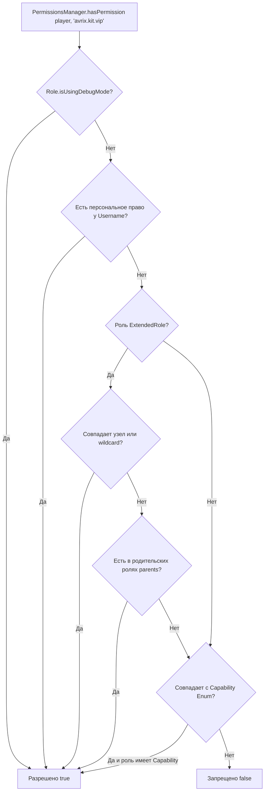

[Главная](../wiki-language.md) > [Документация](wiki-main.md) > Права и роли (Permissions)

## 🛡️ Права и роли (PermissionsManager)

Подсистема прав и ролей **Avrix** расширяет нативную систему ролей Project Zomboid, добавляя строковые узлы прав (
`permissions`), поддержку масок и префиксов (`wildcards`), иерархическое наследование, метаданные (префиксы/суффиксы) и
автоматическое сохранение в базу данных SQLite (`ServerWorldDatabase`).

Управление осуществляется через центральный статический сервис `PermissionsManager`.

---

### Создание и сохранение ролей

Для создания новой роли используйте метод `PermissionsManager.createRole(...)`. Метод автоматически регистрирует роль в
реестре `Roles`, сохраняет её в SQLite базу сервера и выполняет синхронизацию по сети со всеми клиентами.

```java
package com.example.plugin;

import com.avrix.api.events.DefaultEvents;
import com.avrix.api.events.SubscribeEvent;
import com.avrix.api.permissions.ExtendedRole;
import com.avrix.api.permissions.PermissionsManager;
import com.avrix.plugins.Plugin;
import com.avrix.plugins.PluginData;
import zombie.characters.Capability;
import zombie.characters.Roles;
import zombie.core.Color;

import java.util.List;

public class ExamplePlugin implements Plugin {

    private static final String ROLE_VIP = "VIP";

    @Override
    public void onInitialize(PluginData pluginData) {
        // Регистрация слушателей
    }

    @SubscribeEvent(DefaultEvents.ON_SERVER_STARTED)
    private void onServerStarted() {
        // Создаем роль, если она еще не существует в базе данных
        if (Roles.getRole(ROLE_VIP) == null) {
            ExtendedRole vip = PermissionsManager.createRole(
                    ROLE_VIP,
                    "VIP игрок с цветным чатом и привилегиями",
                    new Color(1.0f, 0.84f, 0.0f, 1.0f), // Золотой цвет
                    List.of(Capability.LoginOnServer, Capability.CanSeePlayersStats),
                    "avrix.chat.color",
                    "avrix.commands.fly",
                    "avrix.kits.vip"
            );

            // Настройка префикса и наследования
            vip.setPrefix("&6[VIP]&f ");
            vip.addParent("User");
            vip.setMeta("maxHomes", "3");

            // Сохранение обновленных атрибутов в SQLite
            PermissionsManager.saveRoleToDatabase(vip);
        }
    }
}
```

---

### Назначение ролей игрокам и подключениям

Сервис позволяет назначать роли как онлайн-игрокам (`IsoPlayer`, `UdpConnection`), так и оффлайн-аккаунтам по их
никнейму.

#### 1. Назначение живому игроку в мире

```java

@SubscribeEvent(custom = "OnPlayerConnected")
private void onPlayerJoin(IsoPlayer player, IConnection connection) {
    if ("Brov3r".equalsIgnoreCase(player.getUsername())) {
        // Назначает роль сущности игрока, сетевому сокету и сохраняет запись в SQLite (whitelist)
        boolean success = PermissionsManager.assignRole(player, "VIP");
        System.out.println("Роль назначена: " + success);
    }
}
```

#### 2. Назначение по имени пользователя (онлайн/оффлайн)

```java
// Если игрок в сети — обновит сущность и сеть; если оффлайн — обновит запись в базе данных
PermissionsManager.assignRole("Alex","Moderator");
```

#### 3. Назначение сетевому подключению (`UdpConnection`)

```java
PermissionsManager.assignRole(udpConnection, "Admin");
```

---

### Проверка прав доступа (`hasPermission`)

Проверка выполняется с поддержкой масок (`*`), иерархических префиксов (`avrix.commands.*`), наследования групп и
персональных прав игрока.



#### Примеры проверок в коде:

```java
// 1. Проверка у игрока IsoPlayer
if(PermissionsManager.hasPermission(player, "avrix.commands.heal")){
        player.

getBodyDamage().

RestoreToFullHealth();
}

// 2. Проверка у активного сетевого соединения UdpConnection
        if(PermissionsManager.

hasPermission(connection, "avrix.admin.notify")){
        // Отправка служебного пакета
        }

// 3. Проверка у объекта Role
Role role = player.getRole();
if(PermissionsManager.

hasPermission(role, "avrix.chat.color")){
        // Форматирование цвета
        }
```

---

### Поддержка шаблонов и масок (Wildcards)

| Выданное право (`Granted`) | Запрошенное право (`Checked`) | Результат | Примечание                            |
|:---------------------------|:------------------------------|:---------:|:--------------------------------------|
| `*`                        | *любое право*                 |  `true`   | Глобальный доступ ко всем функциям    |
| `avrix.commands.*`         | `avrix.commands.heal`         |  `true`   | Покрывает все вложенные дочерние узлы |
| `avrix.commands.*`         | `avrix.commands.tp.coords`    |  `true`   | Покрывает многоуровневые вложенности  |
| `avrix.commands.*`         | `avrix.chat.color`            |  `false`  | Другая ветка прав                     |
| `avrix.kit.vip`            | `avrix.kit.vip`               |  `true`   | Точное совпадение                     |

---

### Персональные права пользователей

Если нужно выдать или отозвать право конкретному игроку без изменения его роли:

```java
// Выдать право конкретному никнейму
PermissionsManager.grantPermissionToPlayer("Brov3r","avrix.special.event2026");

// Отозвать персональное право
PermissionsManager.

revokePermissionFromPlayer("Brov3r","avrix.special.event2026");

// Очистить все персональные права игрока (например, при выходе)
PermissionsManager.

clearPlayerPermissions("Brov3r");

// Получить список персональных прав игрока
Set<String> perms = PermissionsManager.getPlayerPermissions("Brov3r");
```

---

### Проверка нативных `Capability` Project Zomboid

Для совместимости с ванильным движком доступны методы проверки стандартного перечисления `Capability`:

```java
// Проверка у живого игрока
boolean canCheat = PermissionsManager.hasCapability(player, Capability.ToggleGodModHimself);

// Проверка у сетевого сокета
boolean canSeeStats = PermissionsManager.hasCapability(connection, Capability.CanSeePlayersStats);

// Проверка у роли
boolean canLogin = PermissionsManager.hasCapability(role, Capability.LoginOnServer);

// Проверка по имени пользователя
boolean canSetupZone = PermissionsManager.hasCapability("Brov3r", Capability.CanSetupNonPVPZone);
```

---

### Удаление роли

```java
// Удаляет роль из памяти, реестра Roles, базы SQLite и удаляет связанные права
boolean deleted = PermissionsManager.deleteRole("OldRole", "AdminName");
```